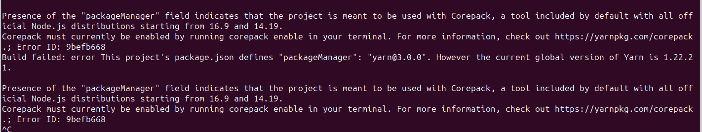

## Issues

Write any issues on developer issues

### issue

local host firebase emulator always times out after 60s
here is solution found on:
https://stackoverflow.com/questions/46005374/how-to-configure-timeout-of-firebase-functions-on-local

### Issue

Linux/Unix
firebase messaging fcm may cause error if you dont use latest node.js 18
as mentioned here solution explained:
`@source` https://stackoverflow.com/questions/72104449/node-js-crypto-fails-to-sign-pem-key-string-from-file-with-error25066067dso-su#comment127440640_72104449

```sh
## put in your local env or bash script
export OPENSSL_CONF=/dev/null
```

Windows (not tested)
possible solution here: https://developer.salesforce.com/forums/?id=9062I000000BmNHQA0

### Issue

latest version of `firebase-admin@^11` is required to run `getFunctions().taskQueue("taskDispatch");`
and it works together with `tasks.taskQueue(...).onDispatch(async (data) => {..`
Unfortunately this version is not compatible with the project causing other errors, would require many features and deps to also be updated

### Issue

There is an issue and misconception with use of enums and constants, they are mixed together with enums in the same files, I also noticed miss-use of enums when assigning values, you should think about enums as kind of constant variables.

These should not mix together, as definitely typed (.d) types and interfaces are only for intelligence not available after compilation in javascript code.

https://stackoverflow.com/questions/66862421/enum-vs-as-const
https://stackoverflow.com/questions/55142177/how-to-build-a-type-from-enum-values-in-typescript
https://www.typescriptlang.org/docs/handbook/enums.html
https://definitelytyped.github.io/

We should not map key names those are for reference, we should use their values instead

```ts
// enums
const enum MESSAGES = {
    FIRST="first",
    NEXT="next"
    LAST="last"
}


// correct
if(MESSAGES.FIRST==='first'){}

// NOT correct
if(MESSAGES.FIRST==='FIRST'){}

// you can constants same way as enums

const MESSAGES2 = {
    FIRST:"first",
    NEXT:"next",
    LAST:"last"
}

// correct
if(MESSAGES2.FIRST==='first'){}

// NOT correct
if(MESSAGES2.FIRST==='FIRST'){}
```

Examples of incorrect usage

- using key names in database instead of key values
  
  
  

## Issue

Some inconsistency with Long package

- solution found here: https://stackoverflow.com/questions/58159115/error-ts2304-cannot-find-name-long-when-compiling-typescript-with-google-ap#58159116

## Issue

Pipeline causing weird issue, no issue when doing manual deploy

**source:**
https://dev.azure.com/xyz/...
need to install @babel/code-frame

## Issue

Upload Error: HTTP Error: 400, <?xml version='1.0' encoding='UTF-8'?><Error><Code>EntityTooLarge</Code><Message>Your proposed upload is larger than the maximum object size specified in your Policy Document.</Message><Details>Content-length exceeds upper bound on range</Details></Error>

solution here:
https://www.codejam.info/2023/04/firebase-functions-entity-too-large.html

## Issue

we had to remove `packageManager` from package.json to avoid firebase giving us an error


**source:** https://stackoverflow.com/questions/77519735/dependency-installation-error-in-github-actions
**source/alternative:** this may work but also creates problems with node_module linking > https://stackoverflow.com/questions/71747609/how-to-specify-packagemanager-in-package-json
