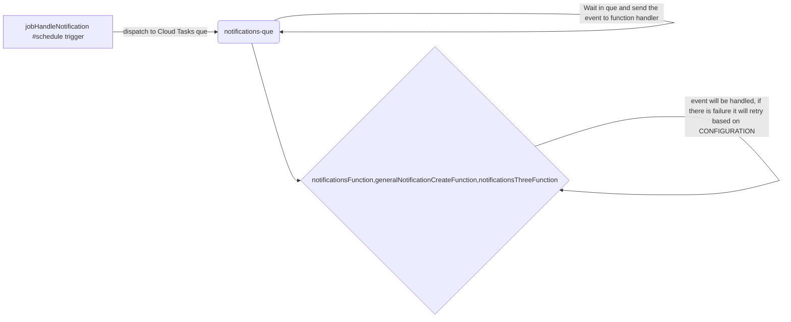
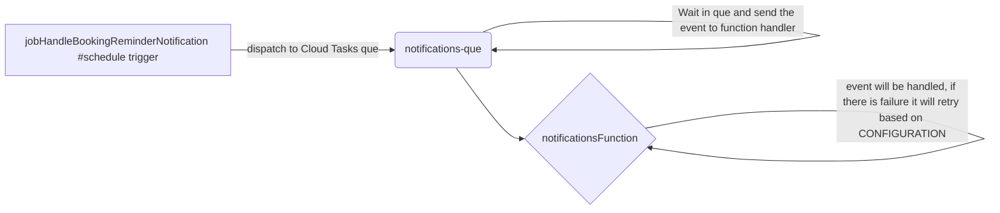
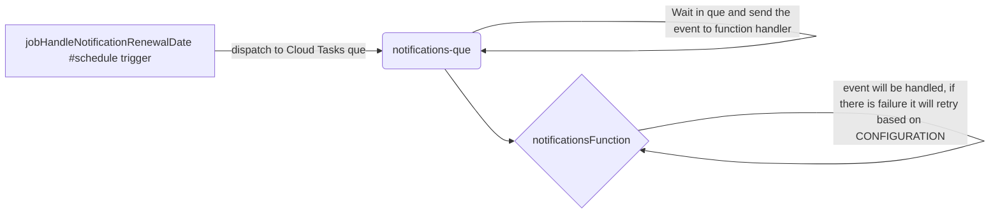
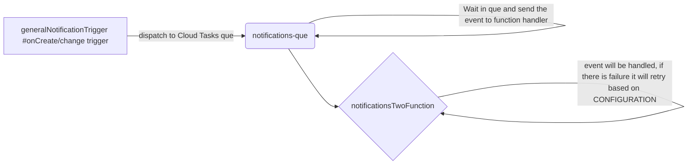
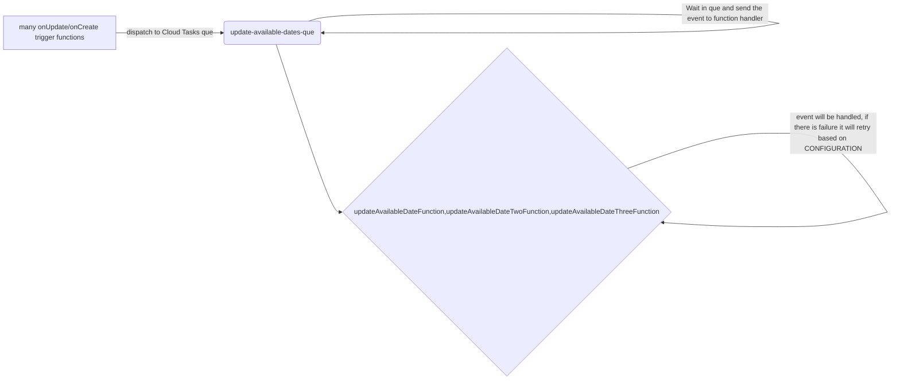
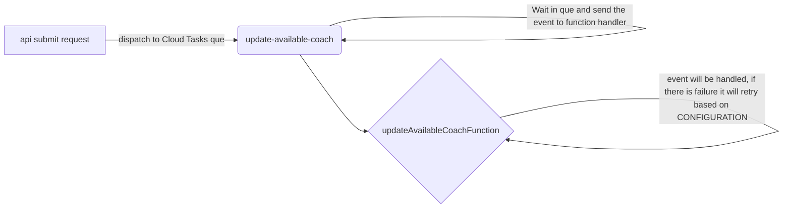

## Firebase Cloud Tasks

This document can be opened as pdf, since **mermaid/diagrams** are not supported on Bitbucket.

[readme.pdf](./readme.pdf)
[Cloud task setup and rules](./setting.cloud.permissions.md)
<br/>

### How are cloud tasks currently implemented on this project

Just to explain the behavior of cloud tasks run in this project, take a look at [example.md](./assets/example.md) on how to run a cloud task.

- if the cloud task failed to execute it will be an indication that something went wrong, it will retry upon failure based on the setting under **CONFIGURATION**, if the limit is reached for given task que item, it will remain in the que indefinitely.

  - you can manually remove the task or try to re/execute it manually, only if you have permissions, please do not do it without asking permission, _we can check logs for user activities..._

- All cloud task function handlers are prefixed with: example**Function**, so you can find it on the cloud functions list.

<br/>

##### Notification events

- Notifications are executed by many trigger functions, there after are handled by one **cloud task** que `notifications-que` that dispatch between two functions: `notificationsFunction, generalNotificationCreateFunction or notificationsThreeFunction`
- tags:
  `[notifications]
[cloudTask]`









<br/>

##### Update calendar service events (Diagram)

- Update calendar service booking colors and settings are called many times by many onUpdate/onCreate trigger functions, and schedule trigger,all are handled by one **cloud task** que: `update-available-dates-que` that dispatch two functions: `updateAvailableDateFunction, updateAvailableDateTwoFunction updateAvailableDateThreeFunction`
- tags: `[updateAvailableDateInServiceOnline]
[updateAvailableDateInServiceOnlineRelay]
[cloudTask]`
- _This event was the biggest database consumer and needed to to be deviled to to smaller chunks and executed via cloud tasks._



<br/>

##### Create or update calendar booking events

- Create or update calendar booking via api submit request (`/v2/booking/updateCoachAvailable`), there are many calls made that also include calling `updateAvailableDateInServiceOnline` function and needed to be moved to **cloud task** que`d jobs.
- tags:
  `[updateAvailableCoachHandler]
[cloudTask]`



<br/>

### create new queues

Please refer to [setting.cloud.permissions.md](./setting.cloud.permissions.md)

### How cloud tasks work

cloud task is que that you create, that can handle triggering functions as http requests with payloads, each task needs to be executed in order with async, cannot have 2 tasks execute at the same time, please take a look at {taskCreate} function and options {cloudTaskCallOptions => CallOptions} to understand the works.

- before you start working with cloud tasks please watch some tutorials and read Cloud Task documentation.
- please note:
  - latest version of `firebase-admin@^11` is required to run `getFunctions().taskQueue("taskDispatch");`
    and it works together with `tasks.taskQueue(...).onDispatch(async (data) => {..`
    Unfortunately this (our current version `firebase-admin@^18.12.1`) is not compatible causing other errors, would require many features and deps to also be updated, so we dont use this feature, as of `02/24/23`, all compatible features are already setup under `/cloud.tasks/..` dir
  - you need to setup permission on each environment: **dev, staging, production**

### Cloud Tasks and permissions (dev | staging | production)

error: Error: 7 PERMISSION_DENIED: The principal (user or service account) lacks IAM permission
means you need to add permissions, follow whats described here: https://firebase.google.com/docs/functions/task-functions
and here: https://stackoverflow.com/questions/51850494/
and above on medium described

also so needs to grand access: add IAM rule
at: https://console.cloud.google.com/iam-admin/serviceaccounts/details/109251451133714865731/permissions?project=kog-kos-konc-dev&supportedpurview=project

steps:

1. In order for cloud tasks to work you first need to enable: Cloud Task product and the App Engine, then follow instructions here: https://cloud.google.com/tasks/docs/tutorial-gcf
2. after creating new task function you need to deploy it first to: dev
3. then you need to run the script that starts with `gcloud functions add-iam-policy-binding {functionName}` below details
4. finally you need to go to this function permission settings, then find the Principal name called: **allUsers** and remove it, then grant new permission and choose Principal called: **allAuthenticatedUsers** , Role > Cloud functions > cloud function invoker.
5. Every step needs to be repeated for each environment: dev | staging | production

### Add new cloud task with cloud function execution

In order to run a cloud function via cloud task que, you first need to:

1. create new que, and run this script replacing `que-name` with your que: `gcloud tasks queues create {que-name}`

   1. this que needs to be added to `{queuesList}` in `./config`

      1. please use lowercase with separator, and include the name {que} in to so we can clearly identify it!

2. Create new function under `./task.functions.ts`, follow setup and conventions from other examples

   1. this function needs to be added to `{taskFunctionList}` in `./config`

      1. please use camelCase , and include the name {function} as suffix.

3. After the function is deployed please follow instructions from above: ** Cloud Tasks and permissions **

   1. Each new function needs to be exported from ./index (project root)

### create cloud task configured queues

Create queues for existing setup

- there is a script at project root that you can execute instead of calling each manually
  - `$/ bash ./update-gcloud-permissions.sh dev`

```sh
 ## cd FirebaseNodeJS/functions

 gcloud auth list ## list projects and set to desired one
 gcloud config set project kog-kos-konc-test

 gcloud tasks queues create update-available-dates-que
 gcloud tasks queues create create-booking-que
 gcloud tasks queues create update-available-coach
 gcloud tasks queues create notifications-que

```

### Set permissions for cloud task functions

Each deployed environment needs to run these set of rules initially

- we have three environments on firebase called as per reference in `FirebaseNodeJS/.firebaserc`
  - kog-kos-konc-dev (dev) | kog-kos-konc-test (staging) | kog-kos-konc (production)

for more details refer to [setting.cloud.permissions.md](./setting.cloud.permissions.md)

```sh
 ## Before executing these calls you need to set environment to which you want to apply these settings
 firebase use dev

 ## this needs to run only 1 time per project environment
gcloud projects add-iam-policy-binding $PROJECT_ID \
  --member=serviceAccount:${PROJECT_ID}@appspot.gserviceaccount.com \
  --role=roles/cloudtasks.enqueuer

## each new exported and deployed function needs to be executed with this script, also permissions for **allAuthenticatedUsers** need to be added, per explenation above

gcloud functions add-iam-policy-binding $FUNCTION_NAME \
  --region=us-central1 \
  --member=serviceAccount:${PROJECT_ID}@appspot.gserviceaccount.com \
  --role=roles/cloudfunctions.invoker


## example
 gcloud projects add-iam-policy-binding kog-kos-konc-dev \
  --member=serviceAccount:kog-kos-konc-dev@appspot.gserviceaccount.com \
  --role=roles/cloudtasks.enqueuer


### for every new function to be used with cloud task you need to add some permissions
gcloud functions add-iam-policy-binding notificationsFunction \
  --region=us-central1 \
   --member=serviceAccount:kog-kos-konc-dev@appspot.gserviceaccount.com  \
  --role=roles/cloudfunctions.invoker

gcloud functions add-iam-policy-binding generalNotificationCreateFunction \
  --region=us-central1 \
   --member=serviceAccount:kog-kos-konc-dev@appspot.gserviceaccount.com  \
  --role=roles/cloudfunctions.invoker

gcloud functions add-iam-policy-binding notificationsThreeFunction \
  --region=us-central1 \
   --member=serviceAccount:kog-kos-konc-dev@appspot.gserviceaccount.com  \
  --role=roles/cloudfunctions.invoker


gcloud functions add-iam-policy-binding updateAvailableDateFunction \
  --region=us-central1 \
   --member=serviceAccount:kog-kos-konc-dev@appspot.gserviceaccount.com  \
  --role=roles/cloudfunctions.invoker


gcloud functions add-iam-policy-binding updateAvailableDateTwoFunction \
  --region=us-central1 \
   --member=serviceAccount:kog-kos-konc-dev@appspot.gserviceaccount.com  \
  --role=roles/cloudfunctions.invoker

gcloud functions add-iam-policy-binding updateAvailableDateThreeFunction \
  --region=us-central1 \
   --member=serviceAccount:kog-kos-konc-dev@appspot.gserviceaccount.com  \
  --role=roles/cloudfunctions.invoker


gcloud functions add-iam-policy-binding createBookingFunction \
  --region=us-central1 \
   --member=serviceAccount:kog-kos-konc-dev@appspot.gserviceaccount.com  \
  --role=roles/cloudfunctions.invoker


  gcloud functions add-iam-policy-binding updateAvailableCoachFunction \
  --region=us-central1 \
   --member=serviceAccount:kog-kos-konc-dev@appspot.gserviceaccount.com  \
  --role=roles/cloudfunctions.invoker

```

### How to Test cloud tasks

How to test cloud tasks against current implementation.

1. Please look at Diagram above to where cloud tasks are integrated so you know where to test
2. Once you run some calendar bookings, create/update/delete booking, have cloud tasks tab open, and check to see for currently running tasks.
   1.  
   2. The `Tasks` tab indicates current and future jobs that are running, any now job may already been processed and will not show anymore.
   3. If task failed, it will retry to available number each task que is configured to handle, when it breached that limit, it will remain it the que until deleted or rerun manually.
   4. When task failed you will see an error in **Logs Explorer**:
      1. 
      2. this cloud task will then retry based on the setting
   5. You can also go to Metrics tab and see how much failed and succeeded in the end.
      1. 

### Resources

for more information you can take a look at documentation and code snippets
https://www.npmjs.com/package/@google-cloud/tasks
https://cloud.google.com/tasks/docs/creating-http-target-tasks#token

useful read
https://medium.com/firebase-developers/how-to-schedule-a-cloud-function-to-run-in-the-future-in-order-to-build-a-firestore-document-ttl-754f9bf3214a

https://cloud.google.com/tasks/docs/creating-queues

Cloud Tasks API
using http end points
https://cloud.google.com/tasks/docs/reference/rest/

Cloud Tasks, references and examples
https://cloud.google.com/tasks/docs/samples/cloud-tasks-taskqueues-deleting-tasks

Google firebase explorer
https://developers.google.com/books/docs/v1/reference/volumes/list
